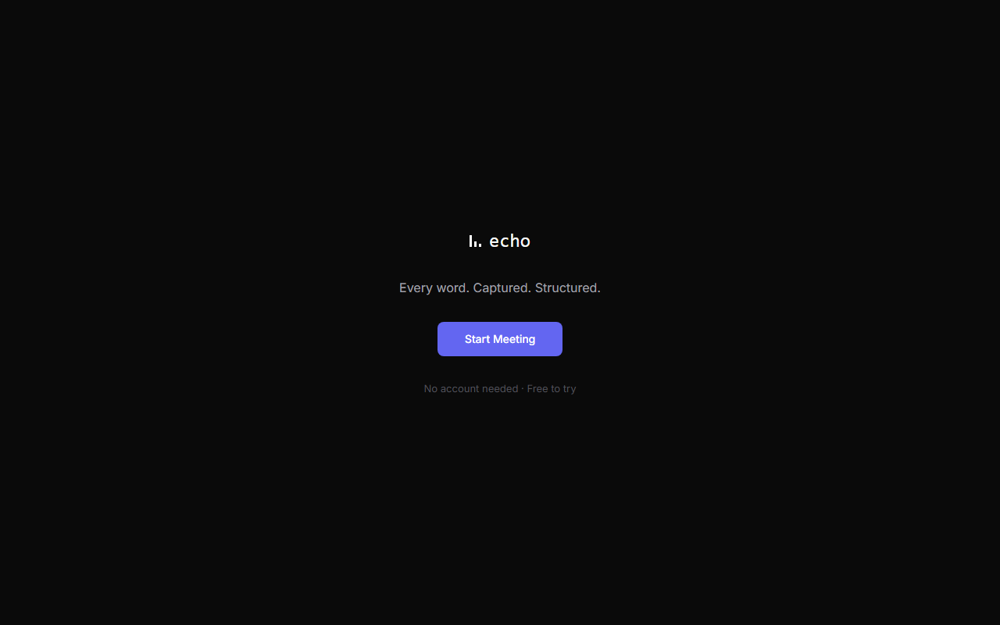

# Echo — Real-Time AI Voice Meeting Copilot

Speak into your browser, watch live captions appear word by word, and get a structured
meeting report — summary, action items with owners, key decisions, topics, attendees —
the moment you stop recording.

**Live app:** https://frontend-omega-three-29.vercel.app
**API:** https://echo-api-46xw.onrender.com

The full pipeline — WebSocket audio in, live SSE captions, LangGraph report out — is
verified working end-to-end in production (tested directly against the deployed API/WS,
not yet through a live browser session against the deployed frontend). CORS is configured
to allow the Vercel origin. See `ECHO.md` Section 9 for deployment details and the bugs
hit along the way.



## What it does

1. The browser captures mic audio via the WebAudio API and streams PCM16 chunks over a
   WebSocket to a FastAPI backend.
2. The backend forwards audio to OpenAI's Realtime API (`gpt-realtime-whisper`), which
   streams transcript deltas back live.
3. Deltas are published to Redis pub/sub, which a Server-Sent Events endpoint forwards to
   the Next.js dashboard in real time — live captions, word by word.
4. When recording stops, a LangGraph agent pipeline runs: `gpt-4.1-mini` extracts action
   items, decisions, attendees, and topics; `gpt-4o` writes a deep summary and sentiment
   read. The structured report is persisted to Postgres and streamed to the dashboard as
   the final SSE event.

## Architecture

```
 Browser (Next.js)
   │  WebAudio API → PCM16 chunks
   ▼
 WebSocket  ────────────────────────────►  FastAPI backend
   │                                          │
   │                                          ▼
   │                              OpenAI Realtime API (gpt-realtime-whisper)
   │                                          │  transcript deltas
   │                                          ▼
   │                                    Redis pub/sub
   │                                          │
   ◄──────────────  SSE  ────────────────────┘  live captions
   │
   │  (on "stop")
   ▼
 LangGraph agent: extractor (gpt-4.1-mini) → summarizer (gpt-4o)
                  → structurer → persister
   │
   ▼
 Neon Postgres (meetings, transcript_segments, meeting_reports)
   │
   ◄──────────────  SSE "done" event  ──────────────  structured report
```

## Tech stack

| Layer | Tech |
|---|---|
| Live transcription | OpenAI Realtime API (`gpt-realtime-whisper`) over WebSocket |
| Agent orchestration | LangGraph — `gpt-4.1-mini` (extraction) + `gpt-4o` (summary) |
| Backend | FastAPI, async throughout, WebSocket + SSE |
| Real-time bridge | Redis pub/sub |
| Database | Postgres (Neon, serverless) |
| Frontend | Next.js 15, TypeScript, Tailwind CSS v4, shadcn/ui |
| Observability | LangSmith tracing |
| Deployment | Render (backend + Redis), Vercel (frontend) |

## Local development

### Backend
```bash
cd backend
python -m venv .venv
./.venv/Scripts/python.exe -m pip install -r requirements.txt   # Windows
# source .venv/bin/activate && pip install -r requirements.txt  # macOS/Linux

cp .env.example .env   # fill in OPENAI_API_KEY, DATABASE_URL (Neon), etc.

docker compose up -d redis
./.venv/Scripts/python.exe -m uvicorn app.main:app --reload --port 8000
```

Run the schema SQL (see `ECHO.md` Section 5) against your Neon database before starting.

### Frontend
```bash
cd frontend
npm install
cp .env.local.example .env.local   # or create it — see ECHO.md Section 4
npm run dev
```

### Tests
```bash
cd backend && ./.venv/Scripts/python.exe -m pytest tests/ -v
cd frontend && npx tsc --noEmit && npm run lint
```

## Project status

Built phase by phase per `ECHO.md`, the full build specification — including every
deviation from the original plan and why (API migrations, dependency conflicts, and a
few real bugs found via live testing rather than mocks). That document is the single
source of truth for this project's architecture and decisions.

## Cost

~$0.19 per 30-minute meeting (audio transcription + two LLM calls). See `ECHO.md` Section 12.

## License

MIT
